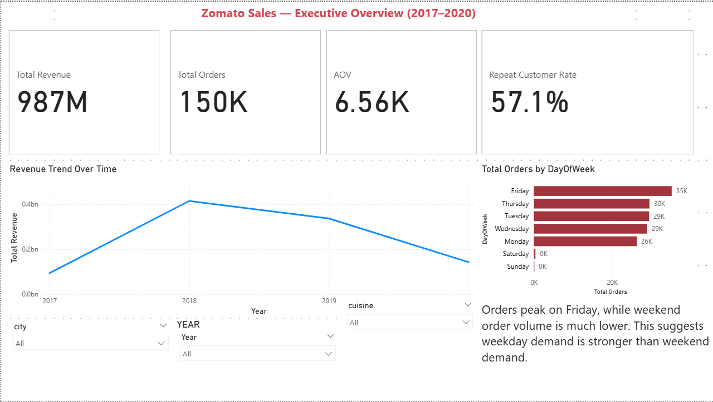
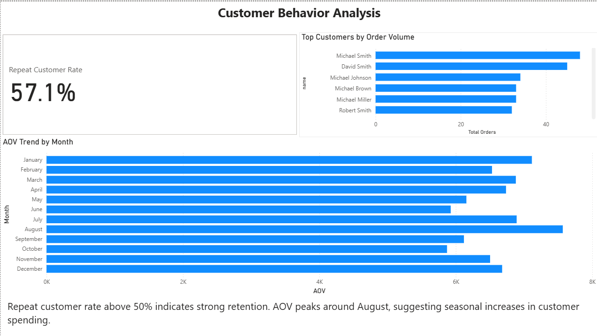
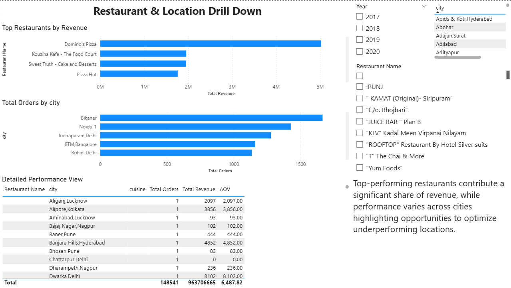

# Zomato Sales Analysis Dashboard (Power BI)

## Overview

This project is a Power BI dashboard built to analyze sales performance and customer behavior using a multi-table dataset.

## Key Features

* Executive Overview with KPIs (Revenue, Orders, AOV, Repeat Rate)
* Customer Behavior Analysis (AOV trends, repeat customer rate, top customers)
* Drill-down analysis by city and restaurant
* Interactive filtering using slicers (Year, City, Restaurant)
## Dashboard Preview

### Executive Overview

### Customer Behavior

### Drill Down Analysis

## Download Dashboard
[Download Power BI File](https://docs.google.com/spreadsheets/d/1vh-3M638izvYakxYysm3bBM3sZXzpSW7R-LbTuB5PVk/edit?usp=sharing)

## Key Insights

* Orders peak on Fridays, while weekend demand is lower
* Repeat customer rate is above 50%, indicating strong retention
* Revenue is concentrated among top-performing restaurants
* AOV varies across months, showing seasonal trends

## Data Model

The model includes:

* Fact table: Orders
* Dimension tables: Restaurant, Users, Menu, Food

## Tools Used

* Power BI
* DAX
* Data Modeling

## Files Included

* Power BI file (.pbix)
* Dashboard screenshots

## How to Use

Download the .pbix file and open it in Power BI Desktop to explore the dashboard.
